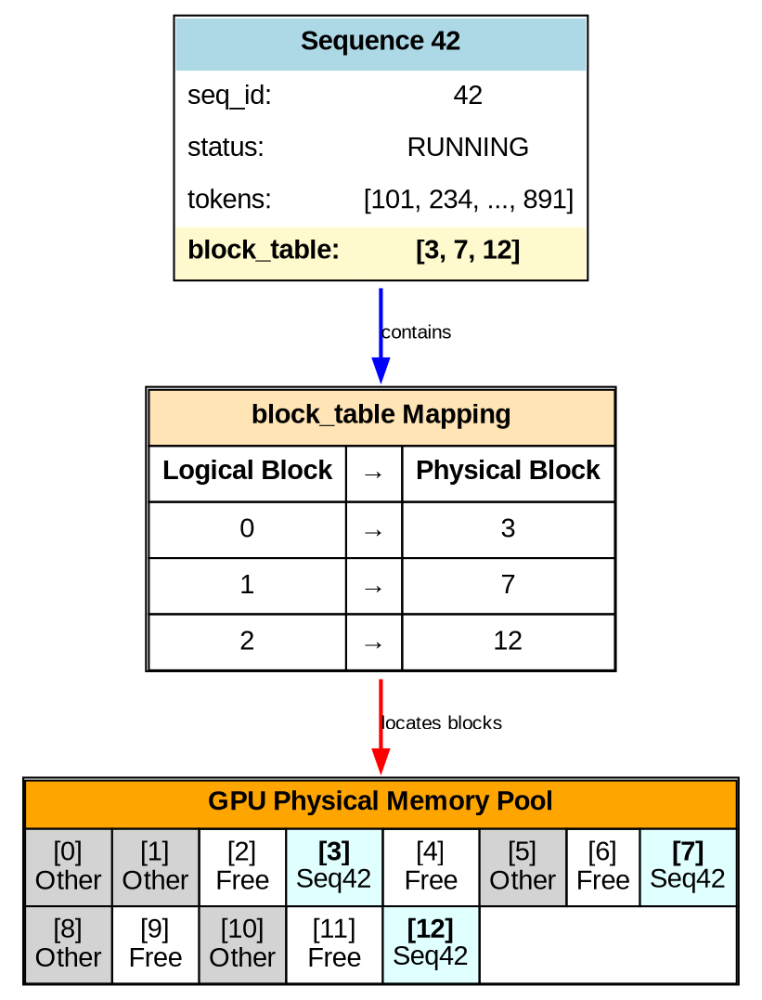
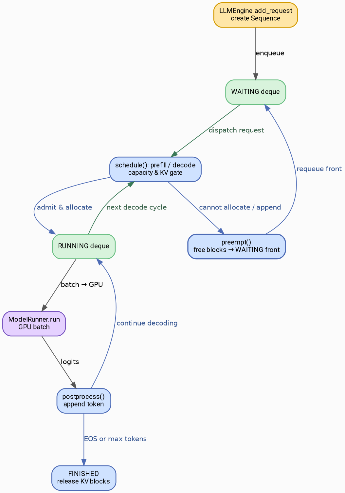

Recently, I've been delving into the architecture of production-grade inference engines. While projects like vLLM and SGLang are crazy sophisticated, their complexity can make detailed code tracing difficult. Over the holidays, I came across [nano-vllm](https://github.com/GeeeekExplorer/nano-vllm)—a tightly scoped codebase that still delivers end-to-end support for Page Attention and scheduling. I took a deep dive into its internals and have compiled my technical notes here.

## Code Structure

nano-vllm features a clean, approachable layout. With the exception of a built-in Qwen3 model definition, virtually all code resides within the `engine/` directory. The core files to pay attention to are:

- `llm_engine.py`: Provides the external `generate` API and delegates requests to the scheduler.
- `sequence.py`: Encapsulates each request inside a `Sequence` object, tracking lifecycle and memory mapping.
- `scheduler.py`: Maintains queues, orchestrates admission, scheduling, and preemption of requests.
- `block_manager.py`: Handles allocation and deallocation of KV-cache blocks, supporting block reuse via hashing.
- `model_runner.py`: Executes the model’s forward pass; one tick of the scheduler corresponds to a single run.

## Core Concepts

### Page Attention

Page Attention is fundamental to vLLM’s performance and adoption, and nano-vllm implements it in a distilled, educational form. Conceptually, it’s a memory management scheme for the key/value (KV) cache in the transformer attention mechanism.

There are two principal constraints during inference:

1. **Limited GPU memory for the KV cache:** After reserving space for model weights and buffers, the available VRAM must be managed efficiently for KV storage.
2. **Variable prompt lengths:** Within a batch, requests can feature highly diverse sequence lengths.

Page Attention segments the KV memory into fixed-size blocks and establishes a mapping between sequence positions (logical blocks) and physical blocks in GPU memory. The key benefits are:

1. Centralized KV memory management—block allocation and reclamation are streamlined in the block table.
2. Each request dynamically receives as many blocks as needed, enabling heterogeneous sequence lengths.
3. Blocks can be shared across sequences with common prefixes, improving efficiency in both compute and memory.

### Sequence and Block

The core abstractions in nano-vllm’s Page Attention are `Sequence` and `Block`.

Every incoming inference request is represented as a `Sequence`:

```python
class Sequence:
    def __init__(self, token_ids: list[int], sampling_params = SamplingParams()):
        self.seq_id = next(Sequence.counter)
        self.status = SequenceStatus.WAITING  # RUNNING, FINISHED
        self.token_ids = copy(token_ids)
        self.last_token = token_ids[-1]
        self.num_tokens = len(self.token_ids)
        self.num_prompt_tokens = len(token_ids)
        self.num_cached_tokens = 0
        self.block_table = []
        self.temperature = sampling_params.temperature
        self.max_tokens = sampling_params.max_tokens
        self.ignore_eos = sampling_params.ignore_eos
```

The central field is `block_table`, which holds the block IDs mapping each segment (logical block) of the sequence to physical blocks. `status` tracks the sequence’s lifecycle, while other fields handle various bookkeeping needs.

Each block in nano-vllm stores the KV tensors for 256 tokens. For example, a prompt of 1,000 tokens would span 4 blocks.

Blocks themselves are straightforward:

```python
class Block:
    def __init__(self, block_id):
        self.block_id = block_id
        self.ref_count = 0
        self.hash = -1
        self.token_ids = []
```

A block includes:

- `block_id`: The physical KV page index; `block_table` entries point here.
- `ref_count`: Indicates how many sequences share this block—crucial for prefix sharing.
- `hash`: Aids in cache hits for shared prefixes (details below).
- `token_ids`: The specific tokens held.

The relationship among sequences, mappings, and physical memory can be visualized as follows:



### Prefill vs. Decode: Scheduling and Memory

During inference, engines alternate between Prefill and Decode stages:

- **Prefill:** Processes the user’s prompt, filling the entire prefix into the KV cache. For long inputs, this phase is compute-heavy, so engines generally process one request at a time while others wait in FIFO order.
- **Decode:** Operates incrementally, generating one token per sequence per iteration. Since this is lightweight, multiple requests can be batched together and run in parallel.

```dot
// ========================================
// KV Cache Perspective: Prefill vs Decode
// ========================================
digraph KVCachePrefillDecode {
    rankdir=LR;
    node [fontname="Arial"];
    edge [fontname="Arial", fontsize=10];
    
    label="";
    labelloc=t;
    fontsize=14;
    
    // Prefill Phase
    subgraph cluster_prefill {
        label="Prefill Phase: Fill KV Cache for Entire Prompt";
        style=rounded;
        color=blue;
        penwidth=2;
        
        // Sequence A
        p_seq_a_before [label=<
            <table border="0" cellborder="1" cellspacing="0" cellpadding="4">
                <tr><td colspan="6">Before Prefill</td></tr>
                <tr><td bgcolor="#ADD8E6"><b>Seq A</b></td><td>Empty</td><td>Empty</td><td>Empty</td><td>Empty</td><td>Empty</td></tr>
            </table>
        >, shape=plaintext];
        
        p_seq_a_after [label=<
            <table border="0" cellborder="1" cellspacing="0" cellpadding="4">
				<tr><td colspan="6">After Prefill</td></tr>
                <tr><td bgcolor="#ADD8E6"><b>Seq A</b></td>
                    <td bgcolor="#FFD700">K₁V₁</td>
                    <td bgcolor="#FFD700">K₂V₂</td>
                    <td bgcolor="#FFD700">K₃V₃</td>
                    <td bgcolor="#FFD700">K₄V₄</td>
                    <td bgcolor="#FFD700">K₅V₅</td>
                </tr>
            </table>
        >, shape=plaintext];
        
        p_seq_a_before -> p_seq_a_after [label="Process all 5 tokens", penwidth=2, color=blue];
    }

    // Decode Phase
    subgraph cluster_decode {
        label="Decode Phase: Incrementally Append 1 token to KV Cache";
        style=rounded;
        color=green;
        penwidth=2;
        
        // Before decode
        d_before [label=<
            <table border="0" cellborder="1" cellspacing="0" cellpadding="4">
                <tr><td colspan="7" bgcolor="#D3D3D3"><b>Before Decode</b></td></tr>
                <tr><td bgcolor="#ADD8E6"><b>Seq A</b></td>
                    <td>K₁V₁</td><td>K₂V₂</td><td>K₃V₃</td><td>K₄V₄</td><td>K₅V₅</td>
                    <td></td>
                </tr>
                <tr><td bgcolor="#FFE4B5"><b>Seq B</b></td>
                    <td>K₁V₁</td><td>K₂V₂</td><td>K₃V₃</td>
                    <td colspan="3"></td>
                </tr>
                <tr><td bgcolor="#E0FFFF"><b>Seq C</b></td>
                    <td>K₁V₁</td><td>K₂V₂</td>
                    <td colspan="4"></td>
                </tr>
            </table>
        >, shape=plaintext];
        
        // After one decode step
        d_after [label=<
            <table border="0" cellborder="1" cellspacing="0" cellpadding="4">
                <tr><td colspan="7" bgcolor="#90EE90"><b>After Decode Step</b></td></tr>
                <tr><td bgcolor="#ADD8E6"><b>Seq A</b></td>
                    <td>K₁V₁</td><td>K₂V₂</td><td>K₃V₃</td><td>K₄V₄</td><td>K₅V₅</td>
                    <td bgcolor="#FFD700">K₆V₆</td>
                </tr>
                <tr><td bgcolor="#FFE4B5"><b>Seq B</b></td>
                    <td>K₁V₁</td><td>K₂V₂</td><td>K₃V₃</td>
                    <td bgcolor="#FFD700">K₄V₄</td>
                    <td colspan="2"></td>
                </tr>
                <tr><td bgcolor="#E0FFFF"><b>Seq C</b></td>
                    <td>K₁V₁</td><td>K₂V₂</td>
                    <td bgcolor="#FFD700">K₃V₃</td>
                    <td colspan="3"></td>
                </tr>
            </table>
        >, shape=plaintext];
        
        d_before -> d_after [label="Generate 1 token\nfor all sequences\n(batched together)", penwidth=2, color=green];
    }
}
```



Given these mechanics, the scheduler coordinates:

- Progressing waiting requests through Prefill before Decode begins.
- Selecting the largest feasible Decode batch from sequences ready to continue.
- Handling memory: allocating blocks before Prefill, growing block tables during Decode, and releasing blocks as necessary when under memory pressure.

Additionally, it manages preemption and restoring sequences, all within a unified queue-based state machine.

## High-Level Workflow

### Scheduling Algorithm

From the scheduler’s perspective, inference proceeds as a sequence of "rounds." Each round, the scheduler determines what to execute, prepares inputs, and invokes `model_runner` for a forward pass.

A high-level outline is:

1. Accept new requests, wrapping each in a `Sequence` with an initial status of `WAITING`.
2. For requests not yet prefilled:
   - Calculate necessary blocks; if available, allocate and Prefill.
   - Once prefilled, move the sequence to the decode-ready set.
3. If there are decode-ready sequences, batch them and perform one Decode step for each:
   - Each sequence emits its next token, updating state.
   - Upon EOS or reaching `max_tokens`, mark as `FINISHED`.
4. If allocation fails (no memory), trigger eviction of other sequences.

The entire lifecycle—from queue admission, through Prefill and Decode, to final release—is tracked by `Sequence` objects and managed via explicit queue transitions.



### Block Allocation & Prefix Sharing

nano-vllm treats the available memory (after model load) as a pool for the KV cache, conceptually akin to a Linux page cache. The `BlockManager` is responsible for maintaining free, used, and hash-indexed block tracking.

Block sharing is enabled by hashing. When a block fills, nano-vllm computes a hash for its token content (including the previous block’s hash, thus representing the sequence prefix). If a block with the same hash already exists, its refcount is incremented and physical memory is shared—with no recomputation needed.

This prefix-chained hashing means that any two sequences with identical prefixes can share those blocks seamlessly.

```dot
digraph PrefixSharingExample {
    rankdir=TB;
    node [fontname="Arial"];
    edge [fontname="Arial", fontsize=10];
    
    label="Prefix Caching: Sharing Blocks via Hash";
    labelloc=t;
    fontsize=14;
    
    // Request A
    subgraph cluster_req_a {
        label="Request A";
        style=rounded;
        color=blue;
        
        req_a [label=<
            <table border="0" cellborder="1" cellspacing="0" cellpadding="4">
                <tr><td bgcolor="#ADD8E6" colspan="4"><b>Token Sequence A</b></td></tr>
                <tr>
                    <td bgcolor="#90EE90">[101, 234]</td>
                    <td bgcolor="#90EE90">[567, 891]</td>
                    <td bgcolor="#FFE4B5">[112, 223]</td>
                    <td bgcolor="#FFE4B5">[334]</td>
                </tr>
                <tr>
                    <td>Hash: 0x1a2b</td>
                    <td>Hash: 0x3c4d</td>
                    <td>Hash: 0xaaa1</td>
                    <td>Hash: 0xbbb2</td>
                </tr>
            </table>
        >, shape=plaintext];
    }
    
    // Request B
    subgraph cluster_req_b {
        label="Request B";
        style=rounded;
        color=green;
        
        req_b [label=<
            <table border="0" cellborder="1" cellspacing="0" cellpadding="4">
                <tr><td bgcolor="#E0FFFF" colspan="4"><b>Token Sequence B</b></td></tr>
                <tr>
                    <td bgcolor="#90EE90">[101, 234]</td>
                    <td bgcolor="#90EE90">[567, 891]</td>
                    <td bgcolor="#FFC0CB">[445, 556]</td>
                    <td bgcolor="#FFC0CB">[667]</td>
                </tr>
                <tr>
                    <td>Hash: 0x1a2b</td>
                    <td>Hash: 0x3c4d</td>
                    <td>Hash: 0xccc3</td>
                    <td>Hash: 0xddd4</td>
                </tr>
            </table>
        >, shape=plaintext];
    }
    
    // Shared blocks
    subgraph cluster_shared {
        label="Shared KV Cache Blocks (Same Hash)";
        style="rounded,filled";
        color="#32CD32";
        fillcolor="#E5FFE5";
        
        shared1 [label="Block 0\n[101, 234]\nHash: 0x1a2b", shape=box3d, fillcolor="#90EE90", style=filled];
        shared2 [label="Block 1\n[567, 891]\nHash: 0x3c4d", shape=box3d, fillcolor="#90EE90", style=filled];
    }
    
    // Private blocks
    private_a [label="Block 2 (A)\n[112, 223]\nHash: 0xaaa1", shape=box3d, fillcolor=lightyellow, style=filled];
    private_a2 [label="Block 3 (A)\n[334]\nHash: 0xbbb2", shape=box3d, fillcolor=lightyellow, style=filled];
    
    private_b [label="Block 2 (B)\n[445, 556]\nHash: 0xccc3", shape=box3d, fillcolor=lightpink, style=filled];
    private_b2 [label="Block 3 (B)\n[667]\nHash: 0xddd4", shape=box3d, fillcolor=lightpink, style=filled];
    
    // Connections
    req_a -> shared1 [label="share", penwidth=2, color=green, style=dashed];
    req_a -> shared2 [label="share", penwidth=2, color=green, style=dashed];
    req_a -> private_a [penwidth=2, color=blue];
    req_a -> private_a2 [penwidth=2, color=blue];
    
    req_b -> shared1 [label="share", penwidth=2, color=green, style=dashed];
    req_b -> shared2 [label="share", penwidth=2, color=green, style=dashed];
    req_b -> private_b [penwidth=2, color=green];
    req_b -> private_b2 [penwidth=2, color=green];
    
    // Note
    note [label="Same prefix → Same hash → Share blocks\nHash includes previous hash → Chain dependency", 
          shape=note, fillcolor=lightyellow, style=filled];
    
    shared1 -> shared2 [label="hash chain", color=red, penwidth=2, constraint=false];
}
```



### Preemption and Eviction

Wherever there’s a scheduler, memory pressure means eviction must be managed.

The trigger in inference engines is straightforward: running out of KV cache space. By evicting requests, more memory is freed for the active set.

- **During Prefill:** If memory is insufficient, drop sequences from the waiting queue until enough space is available for the next Prefill.
- **During Decode:** As sequences generate tokens, the KV cache usage grows. If the engine can’t allocate new blocks, the scheduler preempts active sequences—removing them from the running queue and releasing their associated memory so others can make progress.

```dot
digraph PreemptionSimplified {
    rankdir=LR;
    node [fontname="Arial"];
    edge [fontname="Arial", fontsize=10];
    
    label="";
    labelloc=t;
    fontsize=14;
    
    // Before preemption
    subgraph cluster_before {
        label="Sequences Running, Memory Full";
        style=rounded;
        color=red;
        penwidth=2;
        
        running_before [label=<
            <table border="0" cellborder="1" cellspacing="0" cellpadding="6">
                <tr><td bgcolor="#90EE90" colspan="4">Running Queue (3 seqs)</td></tr>
                <tr><td><b>Seq</b></td><td colspan="3"><b>Blocks</b></td></tr>
                <tr>
                    <td bgcolor="#ADD8E6">Seq A</td>
                    <td bgcolor="#ADD8E6">[0]</td>
                    <td bgcolor="#ADD8E6">[1]</td>
                    <td colspan="1"></td>
                </tr>
                <tr>
                    <td bgcolor="#FFE4B5">Seq B</td>
                    <td bgcolor="#FFE4B5">[2]</td>
                    <td bgcolor="#FFE4B5">[3]</td>
                    <td bgcolor="#FFE4B5">[4]</td>
                </tr>
                <tr>
                    <td bgcolor="#E0FFFF">Seq C</td>
                    <td bgcolor="#E0FFFF">[5]</td>
                    <td bgcolor="#E0FFFF">[6]</td>
                    <td colspan="1"></td>
                </tr>
            </table>
        >, shape=plaintext];
        
        memory_before [label=<
            <table border="0" cellborder="1" cellspacing="0" cellpadding="4">
                <tr><td bgcolor="#FFA500" colspan="8">GPU Memory Pool</td></tr>
                <tr>
                    <td bgcolor="#ADD8E6">[0]<br/>A</td>
                    <td bgcolor="#ADD8E6">[1]<br/>A</td>
                    <td bgcolor="#FFE4B5">[2]<br/>B</td>
                    <td bgcolor="#FFE4B5">[3]<br/>B</td>
                    <td bgcolor="#FFE4B5">[4]<br/>B</td>
                    <td bgcolor="#E0FFFF">[5]<br/>C</td>
                    <td bgcolor="#E0FFFF">[6]<br/>C</td>
                    <td bgcolor="#D3D3D3">[7]<br/>Other</td>
                </tr>
                <tr><td colspan="8" bgcolor="#FF6B6B" align="center"><b>❌ No free blocks!</b></td></tr>
            </table>
        >, shape=plaintext];
        
        running_before -> memory_before [style=invis];
    }
    
    // After preemption
    subgraph cluster_after {
        label="Sequences Running, Memory Available";
        style=rounded;
        color=green;
        penwidth=2;
        
        running_after [label=<
            <table border="0" cellborder="1" cellspacing="0" cellpadding="6">
                <tr><td bgcolor="#90EE90" colspan="4">Running Queue (2 seqs)</td></tr>
                <tr><td><b>Seq</b></td><td colspan="3"><b>Blocks</b></td></tr>
                <tr>
                    <td bgcolor="#ADD8E6">Seq A</td>
                    <td bgcolor="#ADD8E6">[0]</td>
                    <td bgcolor="#ADD8E6">[1]</td>
                    <td bgcolor="#FFD700">[5]</td>
                </tr>
                <tr>
                    <td bgcolor="#FFE4B5">Seq B</td>
                    <td bgcolor="#FFE4B5">[2]</td>
                    <td bgcolor="#FFE4B5">[3]</td>
                    <td bgcolor="#FFE4B5">[4]</td>
                </tr>
            </table>
        >, shape=plaintext];
        
        memory_after [label=<
            <table border="0" cellborder="1" cellspacing="0" cellpadding="4">
                <tr><td bgcolor="#FFA500" colspan="8">GPU Memory Pool</td></tr>
                <tr>
                    <td bgcolor="#ADD8E6">[0]<br/>A</td>
                    <td bgcolor="#ADD8E6">[1]<br/>A</td>
                    <td bgcolor="#FFE4B5">[2]<br/>B</td>
                    <td bgcolor="#FFE4B5">[3]<br/>B</td>
                    <td bgcolor="#FFE4B5">[4]<br/>B</td>
                    <td bgcolor="#FFD700">[5]<br/>A<br/>(new)</td>
                    <td bgcolor="#90EE90">[6]<br/>Free</td>
                    <td bgcolor="#D3D3D3">[7]<br/>Other</td>
                </tr>
                <tr><td colspan="8" bgcolor="#90EE90" align="center"><b>✓ 1 free block!</b></td></tr>
            </table>
        >, shape=plaintext];
        
        running_after -> memory_after [style=invis];
    }
    
    memory_before -> running_after [label="Evict Seq C", penwidth=3, color=red, fontsize=12];
}
```



## Final Thoughts

nano-vllm implements a minimal yet fully-working scheduler and KV-cache manager. Its code structure brings clarity to Page Attention and multi-request scheduling, making these intricate systems much more understandable. When time allows, I hope to map these concepts directly onto vLLM’s full implementation for deeper insights.
