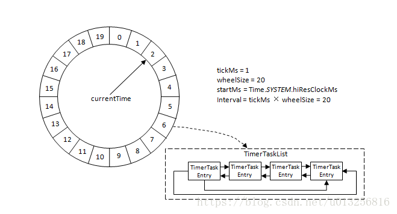
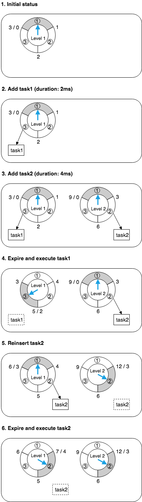

# 2019 September

## 时间轮

https://blog.acolyer.org/2015/11/23/hashed-and-hierarchical-timing-wheels/
https://www.confluent.io/blog/apache-kafka-purgatory-hierarchical-timing-wheels/
http://russellluo.com/2018/10/golang-implementation-of-hierarchical-timing-wheels.html

hierarchical timing wheel，timer 的相关操作：

- start：提供一个延时值和回调函数，超时时会调用回调；
- stop：停止一个 timer 任务；
- 内部操作：per-tick bookkeeping，expiry processing。

实现方式：

- ordered timer list：使用一个有序列表保存 timer，per-tick 地递增时间值，如果超过队首，则触发 timer；insert timer 时间为 O(N)，per tick bookkeeping 时间为 O(1)。
- timer trees：将 timer 保存在一个有序的树结构中，insert timer 时间为个 O(logN)。
- simple timing wheel（包括 netty4 的 HashedWheelTimer）
  - 总长度为 maxInterval 的 circular buffer，每个 tick 对应一个 slot；
  - insert 一个 expire 时间为 j 的 timer，则将 tmier 加入到 slot 对应的 list 上；
  - 每个 tick，current timer index 向前递增1；
  - start、stop、per tick bookkeeping 的时间为 O(1)；
- hashing wheel with ordered timer lists：
  - 如果 maxInterval 的值特别大，simple timing wheel 会浪费很多内存；
  - 搞一个 hash 的 circular buffer；
  - 目标的 slot：j % num-bukets，每个  slot 内部使用有序列表；
  - per tick bookkeeping：将 current time index 递增，处理队列中 expire 的 timer 任务；
  - insert 任务最坏是 O(N)，平均是 O(1)，per-tick bookkeeping 是 O(1)；
- hierarchical timing wheels（包括 kafka 的 Purgatory）
  - 应对 simple timing wheel 的内存占用问题的另一种方式是使用多层 timing wheels；
  - 比如可以有一个 day wheel 包含 100 个 slot，hour wheel 包含 24 个 slot，minute wheel 包含 60 个 slot，seconds slot 包含 60 个 slot；
  - **原先插入到高层时间轮的定时任务，随着时间的流逝，会被降级插入到低层的时间轮中；**

