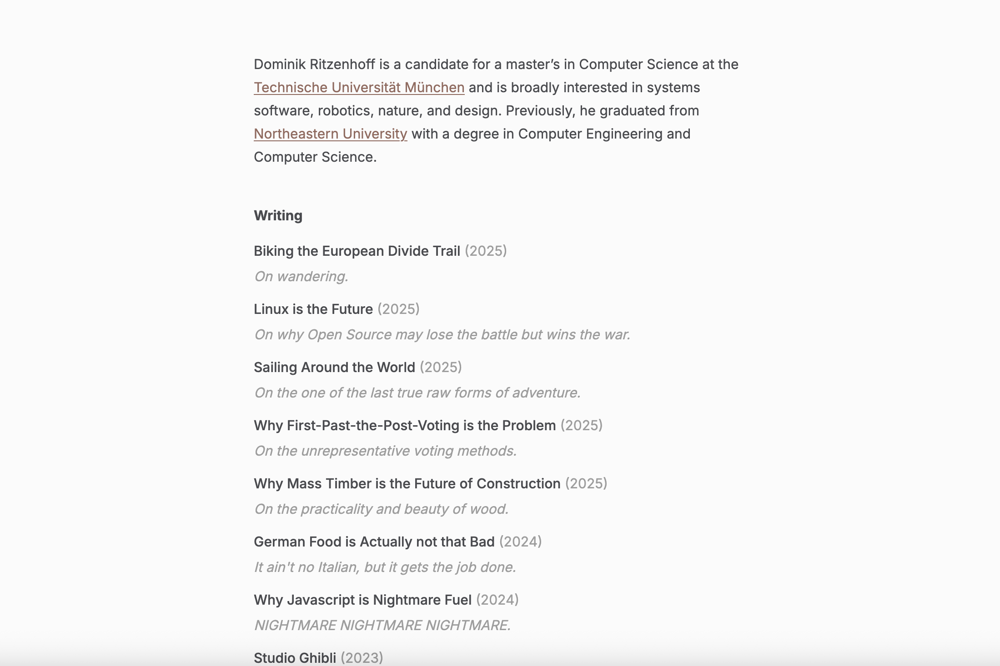

# ritzy

A minimal blogging theme for Hugo.



## Features

- Clean, minimal design focused on content
- Responsive layout that works on mobile and desktop
- LaTeX/MathJax support for mathematical notation
- Code block wrapping for better readability
- Custom 404 page with auto-redirect
- Picture/image support in posts

## Installation

### Option 1: Add as a submodule (recommended)

```bash
cd themes
git submodule add https://github.com/ddritzenhoff/ritzy.git
```

### Option 2: Clone the repository

```bash
cd themes
git clone https://github.com/ddritzenhoff/ritzy.git
```

## Configuration

Add the theme to your site's configuration:

```toml
theme = "ritzy"

[params]
  author = "Your Name"
  description = "Your site description"
```

## Content Structure

ritzy supports the following content structure:

- `content/_about.md` - About section content
- `content/_contact.md` - Contact information
- `content/posts/` - Blog posts

## Post Front Matter

```yaml
---
title: "Your Post Title"
date: 2025-06-17
draft: false
description: "A brief description of your post"
---
```

## LaTeX Support

ritzy includes built-in LaTeX support through MathJax. You can use LaTeX in your posts like this:

Inline math: `$E = mc^2$`

Block math:
```
$$
f(x) = \int_{-\infty}^{\infty} \hat{f}(\xi) e^{2 \pi i \xi x} d\xi
$$
```

## Adding Images

You can add images to your posts with standard Markdown:

```markdown

```

Or with HTML for more control:

```html

```

Images in posts are automatically centered and responsive. You can add captions to images by adding an italicized text immediately after the image:

```markdown

*This is an image caption that will be centered below the image*
```

## Adding Posts

You can add a post like this:

`hugo new posts/<post-name>.md`

## License

This theme is released under the MIT License. See [LICENSE](LICENSE) for details.
